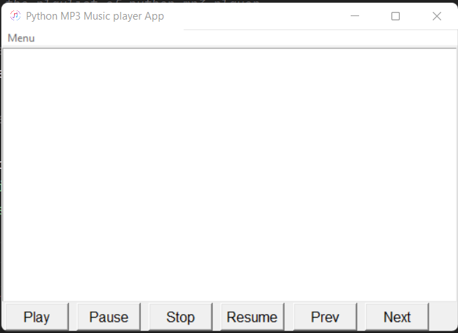
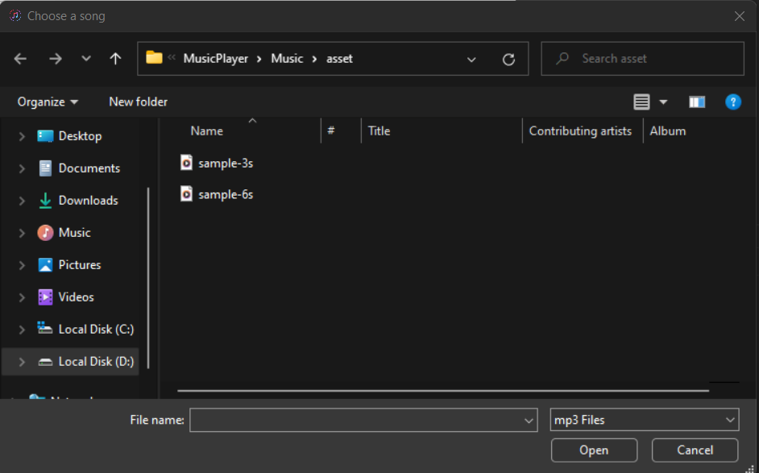
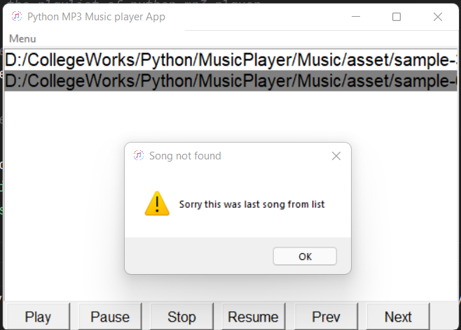

#  Python Music Player
### A simple music player made by using *[PyGame](https://realpython.com/pygame-a-primer/)*, *[tKinter](https://docs.python.org/3/library/tkinter.html)*

This app is made by,
>Madhur Shinde

>Abhay Sharma

>[Abhishek Tiwari](https://github.com/itssabhishek)

under the guidance of
>##### Prof. Jaya Gupta
as a mini-project.

###Project Screenshots

Home

Choosing music files

List of music

Exception handling 
